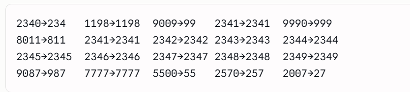

# Exercise 1 — Occupations (Pivot)

**Table:** `hac.occupations` (`name`, `occupation`)

## Task

Pivot the `occupation` column in **OCCUPATIONS** so that each `name` is sorted
alphabetically and displayed underneath its corresponding occupation. The
output should consist of four columns — `Doctor`, `Professor`, `Singer`, and
`Actor` — in that specific order, with their respective names listed
alphabetically under each column. If the number of names is not the same for
all occupations, output `NULL` values in the remaining rows for that column.

**Example input → expected output:**


## Solution

```sql
with occupa_s as (
    select
        *,
        row_number() over (partition by occupation order by name) as rn
    from hac.occupations
)
select
    max(case when occupation = 'Doctor'    then name end) as "Doctor",
    max(case when occupation = 'Professor' then name end) as "Professor",
    max(case when occupation = 'Singer'    then name end) as "Singer",
    max(case when occupation = 'Actor'     then name end) as "Actor"
from occupa_s
group by rn
order by rn;
```

Each name is numbered separately within its own occupation (`row_number()`
partitioned by `occupation`, ordered by `name`), then the rows are pivoted
into columns and grouped back together by that row number so names sharing
the same rank line up on the same output row.

# Exercise 2 — The Blunder

**Table:** `hac.employee` (`employee_id`, `name`, `months`, `salary`)

## Task

Samantha was tasked with calculating the average monthly salaries for all
employees in the **EMPLOYEES** table, but did not realize her keyboard's `0`
key was broken until after completing the calculation. She wants your help
finding the difference between her miscalculation (using salaries with any
zeros removed), and the actual average salary. Write a query calculating the
amount of error (i.e.: `actual − miscalculated` average monthly salaries),
and round it up to the next integer.

## Manual calculation

Stripping the `0` characters out of each salary (not subtracting zero, just
deleting the digit `0` from the string) shows how far off Samantha's version
gets — e.g. `2340` becomes `234`, `9009` becomes `99`, `2007` becomes `27`:



## Solution

```sql
with samantha_data as (
    select
        avg(cast(replace(cast(salary as varchar(50)), '0', '') as float)) as sub_salary
    from hac.employee
),
actual_data as (
    select avg(cast(salary as float)) as salary
    from hac.employee
)
select
    cast(ceiling(actual_data.salary - samantha_data.sub_salary) as integer) as diff
from actual_data, samantha_data;
```

`samantha_data` simulates the typo by casting each `salary` to text and
stripping out every `0` character before averaging it. `actual_data` computes
the real average unmodified. The two averages are then cross-joined (each CTE
produces a single row) so `ceiling(actual - miscalculated)` can be computed
directly and rounded up to an integer.

Two casts in this query are easy to skip and both change the result:

1. **Cast to `float` before `avg()`.** `salary` is `int`, and `AVG()` computes
   `SUM(x) / COUNT(x)` internally. When both operands are `int`, the division
   is integer division, and the result type is `int` by definition — the
   fractional part isn't rounded away later, it's discarded *before* the
   result is even produced, because `int / int` returns `int`. So without the
   cast, `avg(salary)` on integer data silently truncates (e.g. `4046.75`
   becomes `4046`). Casting first — `avg(cast(salary as float))` — forces the
   underlying division to run as `float / float` (or `float / int`, which also
   promotes to `float`), so the fractional part survives. Same rule as `7 / 2`
   giving `3` in C, versus `7.0 / 2` or `float(7) / 2` giving `3.5`: the
   result's type is decided by the operand types, not by whether the "real"
   answer happens to have a fractional part.
2. **Cast the final result to `int`.** `ceiling()` over a `float` still
   returns a `float` (`2253.0`, not `2253`). Since the task asks to "round it
   up to the next integer," the outer `cast(... as integer)` is what actually
   produces an integer value instead of a float that merely looks like one.
