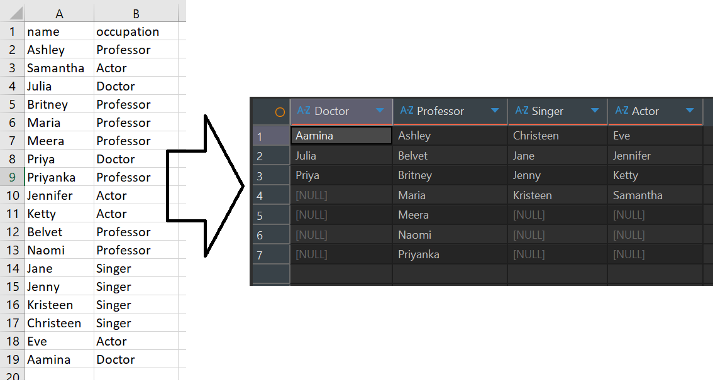

# Exercise 1 — Occupations (Pivot)

**Table:** `hac.occupations` (`name`, `occupation`)

## Task

Pivot the `occupation` column in **OCCUPATIONS** so that each `name` is sorted
alphabetically and displayed underneath its corresponding occupation. The
output should consist of four columns — `Doctor`, `Professor`, `Singer`, and
`Actor` — in that specific order, with their respective names listed
alphabetically under each column. If the number of names is not the same for
all occupations, output `NULL` values in the remaining rows for that column.

**Example input → expected output:**



## Solution

```sql
with occupa_s as (
    select
        *,
        row_number() over (partition by occupation order by name) as rn
    from hac.occupations
)
select
    max(case when occupation = 'Doctor'    then name end) as "Doctor",
    max(case when occupation = 'Professor' then name end) as "Professor",
    max(case when occupation = 'Singer'    then name end) as "Singer",
    max(case when occupation = 'Actor'     then name end) as "Actor"
from occupa_s
group by rn
order by rn;
```

Each name is numbered separately within its own occupation (`row_number()`
partitioned by `occupation`, ordered by `name`), then the rows are pivoted
into columns and grouped back together by that row number so names sharing
the same rank line up on the same output row.
